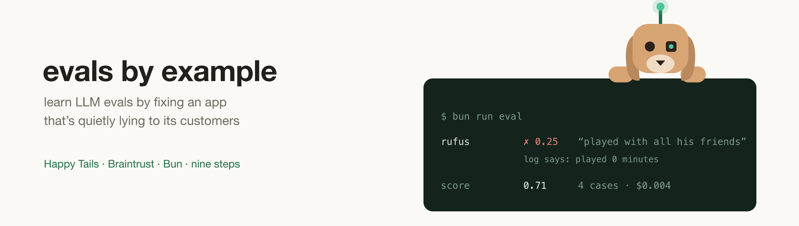

<p align="center">
  
</p>

# Evals by example

**Learn LLM evals by fixing an app that's quietly lying to its customers.**

🐶 **[Read the course](https://destinio.github.io/evals-by-example/)** · **[Install](#quick-start)** · **[The nine steps](#what-youll-build)**

The example app is **Happy Tails**, a dog daycare. The front desk logs each dog's day; the site shows the owner a report card written by an LLM. It works, it looks fine, and nobody has ever checked whether it's true.

Rufus ate nothing, never played, and hid under a bench all morning. His report tells his owner he had a lovely, sociable day.

You've been hired to fix that — not by rewriting the prompt on a hunch, but by measuring it. The course in [`learn/`](learn/README.md) takes you from "no idea if it's any good" to scored experiments, datasets, human feedback, and production monitoring, using [Braintrust](https://braintrust.dev).

## Quick start

```bash
curl -fsSL https://destinio.github.io/evals-by-example/install.sh | bash
```

That clones the repo, installs dependencies, and walks you through setup. ([Read the script](scripts/install.sh) first if you like.) Or by hand:

```bash
git clone https://github.com/destinio/evals-by-example.git && cd evals-by-example
bun run setup
```

`setup` checks your Bun version, installs dependencies, asks for the two API keys it needs, verifies both actually answer, and seeds the database. Then:

```bash
bun run app
```

Open **http://localhost:3022**, click **Rufus**, and read his report against the timeline underneath it. That gap is the whole project.

Then open **http://localhost:3022/learn** — the course is served beside the app — and start at step 1. It also reads online at **[destinio.github.io/evals-by-example](https://destinio.github.io/evals-by-example/)**.

### What you need

- **[Bun](https://bun.sh) 1.4+**. No Node, no bundler, no framework.
- **A model API key.** Anything OpenAI-compatible. The default is the [Nous](https://portal.nousresearch.com) router, which serves Claude models under ids like `anthropic/claude-haiku-4.5`; set `NOUS_BASE_URL` and `MODEL` to point somewhere else.
- **A [Braintrust](https://braintrust.dev) account** from step 1 onward. The free tier covers this whole course comfortably.

Reports cost about a tenth of a cent each. Every experiment in the course is a few cents.

## What you'll learn

Every idea is introduced on the day the app actually needs it, not as theory up front:

- **Tracing** — recording what your LLM app did, what it cost, and what data it saw
- **Scorers** — grading outputs 0 to 1, starting with plain code and no AI at all
- **Experiments** — running a prompt over fixed test cases and getting a number you can compare
- **Datasets** — keeping the hard cases forever so fixes can't silently regress
- **Comparing prompt versions** — row-by-row diffs, including what a change made *worse*
- **LLM-as-a-judge** — using a model to grade what code can't check, and validating that judge against human opinion before trusting it
- **Human feedback** — turning thumbs-down and corrections into test cases
- **Prompt management** — versioned prompts and a playground, so changes don't need a deploy
- **Online scoring** — scoring live production traffic and watching quality and cost over time
- **Shipping safely** — trials to beat run-to-run noise, and a regression gate in CI

## What you'll build

Nine steps, each ending in something you can show someone. The **[course site](https://destinio.github.io/evals-by-example/)** maps all of them, including the ones still being written:

| # | Step | You end up able to say |
|---|---|---|
| 1 | Observe | "Here's every report we've ever written, with its cost and the data behind it" |
| 2 | Score one thing | "67%, and here's the exact row that failed" |
| 3 | Keep the hard cases | "The awkward days are permanent now" |
| 4 | Fix the prompt, prove it | "v1 against v2, row by row, including what got *worse*" |
| 5 | Judge what code can't | "Code catches invented numbers; a judge catches buried medication" |
| 6 | Ask the humans | "A complaint on Tuesday is a test case on Wednesday" |
| 7 | Iterate without deploying | "Change the prompt, try it on 20 real days, ship it, no deploy" |
| 8 | Watch production | "Quality and cost per day, and an alert when either moves" |
| 9 | Ship it honestly | "This is what runs before anyone touches the prompt" |

Full descriptions in [learn/README.md](learn/README.md).

## Learning with an AI assistant

In Claude Code, this repo ships a **`/tutor`** skill. It works out which step you're on from your step folders and your code, teaches one idea at a time, and checks your work — it won't do the steps for you. `CLAUDE.md` holds the same ground rules for any agent, so an assistant that's never seen this repo won't hand you finished answers.

## How the repo is laid out

| Path | What it is |
|---|---|
| [`app/`](app/README.md) | The product: Bun server, SQLite, one LLM call. Its README covers routes and schema. |
| [`learn/`](learn/README.md) | The course. One markdown file per step, also served at `/learn`. |
| `scripts/` | `install.sh`, `setup`, `step` (worktrees), `check:start`, `docs:build` |
| `CLAUDE.md` | Context and rules for AI agents working here |

## Commands

```bash
bun run setup          # first-time setup; --check to verify without prompting
bun run docs:build     # rebuild the course site into docs/
bun run app            # the daycare at http://localhost:3022
bun run dev            # same, with hot reload
bun run step 1         # start step 1 in its own folder and port
bun run step           # list your step folders
bun run check:start    # is main still a clean starting point?
```

## How steps and branches work

**Your main folder stays on `main`, and `main` stays un-instrumented** — adding Braintrust is step 1, so it can't already be there. `bun run check:start` enforces that.

**Each step lives in its own folder** (a git worktree), created with `bun run step`:

```
evals-by-example/                  ← main, port 3022
evals-by-example-steps/
  step-01-observe/                 ← port 3023
  step-02-score/                   ← branched from step 1, port 3024
```

Your work is committed in the step folder. What goes back to `main` is the course getting better — step write-ups, clearer explanations, app fixes — and each step folder picks those up with `git merge main`. So the next run through, yours on demo day or someone else's, starts from everything the last one learned. Full walkthrough in [learn/README.md](learn/README.md#how-the-steps-work).

## Starting over

Your main folder is already the start. To clear the reports it has generated:

```bash
rm app/data/happytails.db    # reseeds on next launch: four dogs, the original two-line prompt
bun run check:start
```

Each step folder has its own database, so resetting one never touches another.

## The four dogs

They're the test set, and three of them are traps.

| Dog | Their day | What it catches |
|---|---|---|
| **Bella** | Ate everything, played, napped | Nothing. The control. |
| **Rufus** | Ate 0g of 200g, no play, hid under a bench | Invented cheer |
| **Nacho** | Carprofen at 12:05, snapped at another dog | Buried facts the owner needs |
| **Mochi** | Two meals, three play sessions, five potty breaks | Numbers quietly getting wrong |
